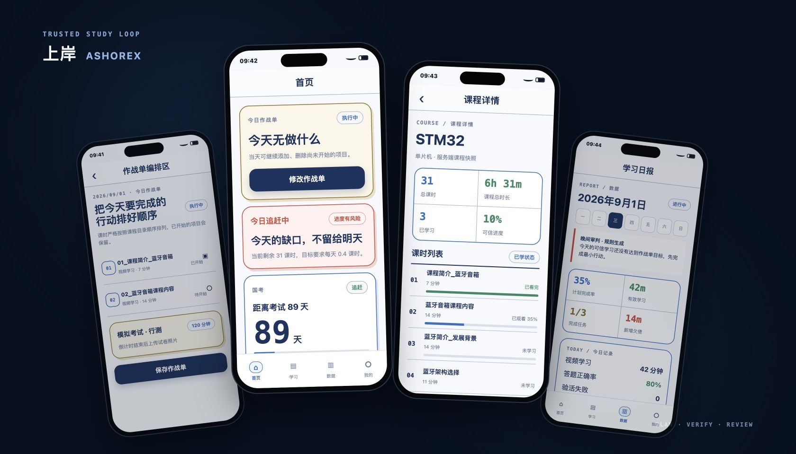
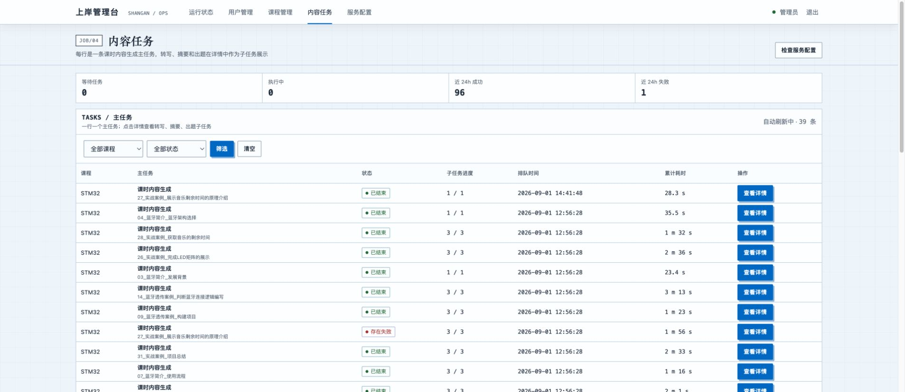
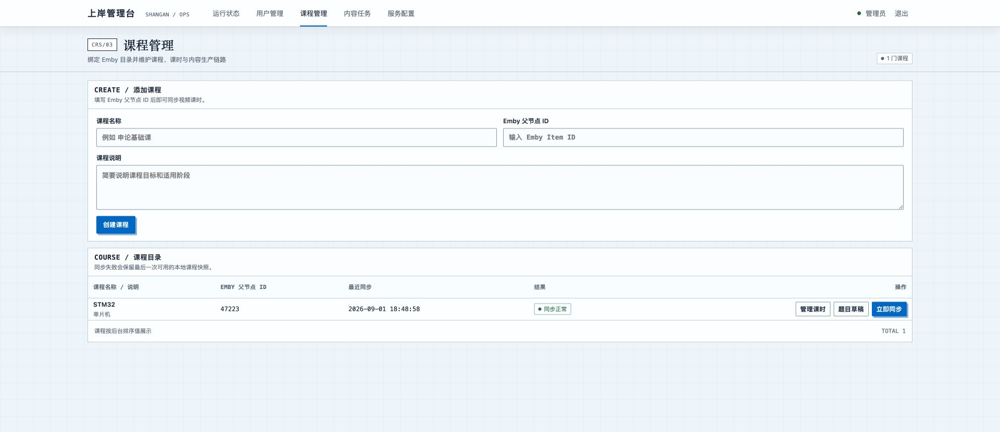

<div align="center">

# 上岸 · Ashorex

**把备考计划、可信学习、学习欠债与复盘连成一个可审计闭环。**

[](https://github.com/kiliter/Ashorex/actions/workflows/ios-verify.yml)
[](https://github.com/kiliter/Ashorex/actions/workflows/server-verify.yml)


[产品预览](#产品预览) · [核心能力](#核心能力) · [快速开始](#快速开始) · [构建产物](#github-actions-构建产物) · [项目文档](#项目文档)

</div>

> [!IMPORTANT]
> 上岸当前处于 V1.x.x 开发与真机验收阶段，面向自托管和小规模使用场景。V1 不提供课程售卖、社交或学习端 AI Chat；V2/V3 方向已记录在路线图中，但尚不是实现任务。

## 产品预览

### 移动学习端

<p align="center">
  
</p>

<p align="center"><sub>从左到右：作战单编排、今日首页、课程可信进度与学习日报。</sub></p>

### 内部管理后台

<p align="center">
  
  
</p>

<p align="center"><sub>管理后台负责课程同步、内容任务、题目草稿与运行配置；学习端不接触外部服务密钥。</sub></p>

## 它解决什么

很多学习工具只记录“打开过”或“播放过”，却无法回答三个更重要的问题：今天承诺了什么、实际可信完成了多少、未完成的部分去了哪里。

上岸围绕一条明确的学习闭环工作：

```text
考试目标
  → 编排今日作战单
  → 可信视频学习 / 答题 / 模拟考试 / 专注计时
  → 日终自动结算
  → 未完成承诺形成学习欠债
  → 日报、周报与晚间审判
  → 下一天继续完成或还债
```

## 核心能力

| 能力 | 说明 |
|---|---|
| 今日作战单 | 集中编排课时和模拟考试，原子保存；当天可继续添加，并允许修改尚未开始的项目。 |
| 可信视频学习 | 服务端维护可信最大进度，校验心跳、倍速和前台状态；禁止跳入未验证区间，允许回看。 |
| 进度验活 | 按视频内容进度百分比触发验活，默认每推进 50% 检查一次；等待确认期间不累计可信时长。 |
| 模拟考试与专注 | 使用考试预置启动倒计时并上传试卷照片；番茄钟和练习计时作为独立小工具运行。 |
| 学习欠债 | 日终把作战单内未完成的视频观看与必答内容拆成可追踪欠债，后续学习可精确偿还。 |
| 日报与周报 | 汇总可信学习、答题、专注、欠债、复习审计和日终结果，并生成确定性的晚间审判。 |
| 课程内容生产 | 从 Emby 音频流生成全文、Markdown 摘要和待审核题目草稿；管理员发布后才进入正式题库。 |
| 内部管理后台 | 管理用户、课程、课时、内容任务、题目草稿、外部服务配置和运行状态。 |

## 系统架构

```text
┌──────────────────────────────────┐
│ Flutter Mobile App               │
│ iPhone / iPad / Android          │
│ 首页 · 学习 · 数据 · 我的         │
└───────────────┬──────────────────┘
                │ HTTPS / REST
                ▼
┌──────────────────────────────────┐
│ Spring Boot 模块化单体            │
│ Identity · Catalog · Planning    │
│ Learning · Debt · Reporting      │
│ AI Content · Emby · Admin        │
└───────┬────────────┬─────────────┘
        │            │
        ▼            ├──────────────► Emby
     SQLite          └──────────────► ASR / LLM
```

- 业务真相保存在服务端，Flutter 页面不直接调用 Dio，而是通过 Repository 和 Controller 访问 API。
- 服务端采用单实例、模块化单体和本机 SQLite WAL，目标规模为少于 5 人同时在线。
- Emby、ASR、LLM 与 OpenRouter 密钥只存在于服务端环境或管理后台配置中。
- AI 仅用于课时转写、摘要和待审核题目草稿，不读取或修改计划、欠债、可信进度与报表。

## 技术栈

| 区域 | 技术 |
|---|---|
| 移动端 | Flutter 3.44.7、Dart 3.12、Riverpod、go_router、Dio、video_player |
| 服务端 | Java 21、Spring Boot 4.1.1、Spring MVC、Virtual Threads、JdbcClient |
| 数据与迁移 | SQLite WAL、Flyway |
| 管理后台 | Thymeleaf、Spring Security Session、少量原生 JavaScript |
| 媒体与内容 | Emby、OpenAI-compatible ASR / LLM、LangChain4j |
| 交付 | GitHub Actions、Docker、Caddy、FVM、Maven Wrapper |

## 快速开始

### 环境要求

- macOS 与 Xcode：运行 iPhone / iPad 模拟器时需要。
- Flutter `3.44.7`：通过 [FVM](https://fvm.app/) 锁定。
- Java `21`：仓库提供 `.sdkmanrc` 与 Maven Wrapper。
- Android Studio / Android SDK：构建或调试 Android 时需要。
- Docker 与 Docker Compose：仅容器部署时需要。

### 本地联调

```bash
git clone https://github.com/kiliter/Ashorex.git
cd Ashorex

# 首次准备 Flutter SDK 与依赖。
cd apps/ios
fvm install
fvm flutter pub get
cd ../..

# 默认启动 Spring Boot、iPhone 模拟器和 Flutter，服务端监听 18080。
./run.sh
```

首次创建管理账号时，请在当前终端通过环境变量注入用户名和密码，不要把密码写入仓库：

```bash
export ADMIN_BOOTSTRAP_USERNAME=admin
export ADMIN_BOOTSTRAP_PASSWORD='<仅用于本地开发的密码>'
./run.sh
```

其他常用启动方式：

```bash
./run.sh server   # 只启动 Spring Boot
./run.sh ios      # 只启动 iPhone 模拟器与 Flutter
```

启动后可访问：

- App API 与健康检查：`http://127.0.0.1:18080/actuator/health`
- 内部管理后台：`http://127.0.0.1:18080/admin`

### 执行验证

```bash
./test.sh          # 服务端与 Flutter 完整验证
./test.sh server   # 仅服务端逻辑、协议与 Controller 测试
./test.sh ios      # Flutter 格式、静态分析和测试

make format
make verify
```

### Docker Compose

#### 本地构建

```bash
cp .env.example .env
# 编辑 .env，并通过安全方式填入 JWT、播放票据、管理员及外部服务配置。

# 先验证并生成服务端 JAR，再构建容器。
make server-test
docker compose --env-file .env -f infra/compose.yml up --build -d
```

#### 使用 GitHub 发布镜像部署

生产部署直接拉取 `ghcr.io/kiliter/ashorex-server:latest`，不需要在服务器上安装 Java、Maven 或构建 JAR。开始前需要准备：

- Docker Engine 和 Docker Compose Plugin。
- 一台使用本地磁盘保存 Docker 数据的服务器；SQLite 不得位于 NAS、NFS 等网络文件系统。
- 已有的 HTTPS 反向代理，以及指向部署服务器的域名。

推荐使用统一脚本完成部署和维护：

```bash
# 打开中文交互菜单，根据提示选择部署、更新或卸载。
./infra/scripts/deploy.sh
```

交互菜单如下：

```text
========== 上岸 Docker 管理 ==========
1. 首次部署 / 重新部署
2. 更新 GitHub 最新镜像
3. 卸载服务（保留 SQLite 和备份）
4. 彻底卸载（永久删除全部数据）
0. 退出
```

需要用于自动化时，也可以直接传入子命令：

```bash
# 首次部署：自动生成 .env.deploy、两条安全密钥和管理员密码。
./infra/scripts/deploy.sh deploy

# 拉取 GitHub 最新镜像并更新，保留全部数据。
./infra/scripts/deploy.sh update

# 卸载容器和镜像，默认保留 SQLite 与备份数据卷。
./infra/scripts/deploy.sh uninstall

# 永久删除容器、镜像、SQLite 和备份数据卷，需要输入 DELETE 二次确认。
./infra/scripts/deploy.sh uninstall --purge-data
```

首次部署完成后，脚本会输出随机生成的 `admin` 初始密码。部署配置同时保存在权限为 `600` 的 `.env.deploy` 中；该文件已被 Git 忽略。普通卸载不会删除该文件和数据卷。

以下是不用脚本时的手工部署步骤。

1. 创建部署环境文件：

   ```bash
   cp infra/deploy.env.example .env.deploy
   chmod 600 .env.deploy
   openssl rand -hex 32
   openssl rand -hex 32
   ```

   将两次生成的不同随机值和管理员密码写入 `.env.deploy`：

   ```dotenv
   JWT_SECRET=<第一条随机值>
   PLAYBACK_TICKET_SECRET=<第二条随机值>
   ADMIN_BOOTSTRAP_PASSWORD=<初始管理员密码>
   ```

   `.env.deploy` 已被 Git 忽略，不得把真实密钥提交到仓库。若 GHCR 包不是公开包，还需要先使用有 `read:packages` 权限的 GitHub Token 执行 `docker login ghcr.io`。

2. 拉取镜像并启动：

   ```bash
   docker compose --env-file .env.deploy -f infra/compose.deploy.yml pull
   docker compose --env-file .env.deploy -f infra/compose.deploy.yml up -d
   docker compose --env-file .env.deploy -f infra/compose.deploy.yml ps
   ```

3. 检查健康状态和启动日志：

   ```bash
   curl --fail http://127.0.0.1:18080/actuator/health
   docker compose --env-file .env.deploy -f infra/compose.deploy.yml logs --tail=200 server
   ```

   健康接口应返回 `UP`，日志中不应出现数据库迁移或配置错误。

4. 配置现有反向代理：

   - 上游地址使用 `http://部署服务器IP:18080`。
   - 对外必须启用 HTTPS，并转发 `Host`、`X-Forwarded-For` 和 `X-Forwarded-Proto`。
   - 保留客户端的 `Range`、`If-Range` 请求头以及上游的 `Content-Range`、`Accept-Ranges` 响应头。
   - 视频响应使用流式转发，不要完整缓冲，并设置足够长的读取超时。
   - 服务端监听 `0.0.0.0:18080`；使用防火墙或安全组限制公网直接访问该端口。

5. 首次配置：

   使用用户名 `admin` 和 `.env.deploy` 中的初始密码登录 `https://你的域名/admin`，然后在管理后台配置 Emby、ASR、LLM 和 OpenRouter。Emby 位于 Docker 宿主机时可填写 `http://host.docker.internal:8096`；不要填写容器自身的 `localhost`。

6. 更新 GitHub 镜像：

   ```bash
   docker compose --env-file .env.deploy -f infra/compose.deploy.yml pull
   docker compose --env-file .env.deploy -f infra/compose.deploy.yml up -d --remove-orphans
   ```

停止服务可执行以下命令；不要附加 `-v`，否则会删除 SQLite 和备份数据卷：

```bash
docker compose --env-file .env.deploy -f infra/compose.deploy.yml down
```

生产部署使用 Docker 本地卷 `study-data` 和 `study-backup`。同一 SQLite 数据卷只能由一个服务实例使用，备份和恢复步骤见[运行手册](docs/runbooks/backup-restore.md)。

## GitHub Actions 构建产物

| 产物 | 获取方式 | 说明 |
|---|---|---|
| 无签名 IPA | [Releases](https://github.com/kiliter/Ashorex/releases) 或手动运行“移动端验证” | 需要自行签名后才能安装到真机。 |
| Android Debug APK | [Releases](https://github.com/kiliter/Ashorex/releases) 或手动运行“移动端验证” | 用于开发和内部验证，不是正式发布包。 |
| Docker 镜像归档 | [Releases](https://github.com/kiliter/Ashorex/releases) 或手动运行“服务端验证” | 下载后可通过 `docker load` 导入。 |
| GHCR 镜像 | `ghcr.io/kiliter/ashorex-server:latest` | `main` 分支验证通过后推送。 |

普通 Push 和 Pull Request 只执行验证，不保存大体积 Artifact。手动运行工作流时，临时 Artifact 保留 3 天；推送 `v*` 标签时，三个安装产物会自动进入对应 GitHub Release。也可以直接拉取最新服务端镜像：

```bash
docker pull ghcr.io/kiliter/ashorex-server:latest
```

## 仓库结构

```text
Ashorex/
├── apps/
│   ├── ios/        # Flutter 移动端；目录名为历史命名，同时支持 iOS、iPadOS 和 Android
│   └── server/     # Spring Boot 模块化单体与 Thymeleaf 管理后台
├── docs/
│   ├── specs/      # 冻结的产品与技术设计规范
│   ├── plans/      # 实施计划
│   ├── traceability/ # 需求—实现—验收追踪矩阵
│   ├── roadmap/    # 未来版本方向与进入开发前的门禁，不是实施计划
│   ├── prototypes/ # 仓库内产品原型快照，不依赖个人电脑绝对路径
│   ├── adr/        # 架构决策记录
│   ├── api/        # OpenAPI 合同
│   └── runbooks/   # 备份恢复与真机验收手册
├── infra/          # Docker、Caddy 与运维脚本
├── run.sh          # 本地统一启动入口
├── test.sh         # 本地统一验证入口
└── Makefile        # CI 与开发命令
```

## 项目文档

修改代码前请依次阅读：

1. [协作与工程约束](AGENTS.md)
2. [V1 产品与技术设计规范](docs/specs/2026-08-27-shangan-v1-design.md)
3. [V1 实施计划](docs/plans/2026-08-27-shangan-v1-implementation-plan.md)
4. [需求—实现—验收追踪矩阵](docs/traceability/2026-08-27-shangan-v1-traceability.md)
5. [版本路线图](docs/roadmap/2026-09-04-shangan-version-roadmap.md)
6. 与改动相关的 [ADR](docs/adr/)

版本路线图只用于理解 V2/V3 方向，不能代替冻结 Spec 或授权实现。API 变更必须同步更新 [OpenAPI 合同](docs/api/openapi.yaml)。本地只运行本次新增或修改对应的窄测试；全量 `make verify` 由 GitHub CI 执行。

## 版本路线图

| 版本线 | 方向 | 当前状态 |
|---|---|---|
| V1.x.x | 固定现有需求和主逻辑，只做已批准实现、Bug 修复与 UI 调整 | 当前活动开发线 |
| V2.x.x | 面向学习者的 AI 助教、基于「毛线团团」的学习伙伴升级，以及 Server酱日报/周报投递 | 方向已确认，未形成实施授权 |
| V3.x.x | 全 App 优化、多实例/多集群、外观个性化、课程仅音频播放、画中画，以及 PDF 资料阅读闭环 | 方向已确认，未形成实施授权 |

进入 V2 或 V3 编码前，必须先完成并人工批准该版本的 Spec、ADR、Implementation Plan 和 Traceability。完整说明见[版本路线图](docs/roadmap/2026-09-04-shangan-version-roadmap.md)。

## V1 边界

- 客户端覆盖 iPhone、iPad 和 Android；不提供 PC 学习 Web 或桌面客户端。
- 不实现支付、商城、直播、社交、离线视频、DRM、微服务、Redis、Kafka 或向量数据库。
- 不提供 AI Chat、智能体、MCP、联网搜索或 AI 对学习业务数据的写入。
- 真实视频播放必须在物理 iPhone、iPad 和 Android 设备完成 smoke test；模拟器结果不能替代真机验收。

## 安全与许可

- 不要提交 JWT Secret、管理员密码、Emby / ASR / LLM / OpenRouter API Key 或生产地址凭据。
- 生产部署使用 HTTPS；刷新令牌以哈希形式保存，管理后台使用 HttpOnly Session Cookie 与 CSRF。
- 仓库当前尚未提供 `LICENSE`，因此不会自动授予复制、修改或分发权限。公开协作或再分发前，应由维护者选择许可证并补充 `LICENSE` 文件。

---

<p align="center">为每一次真实学习留下证据，也为每一次未完成留下去处。</p>
